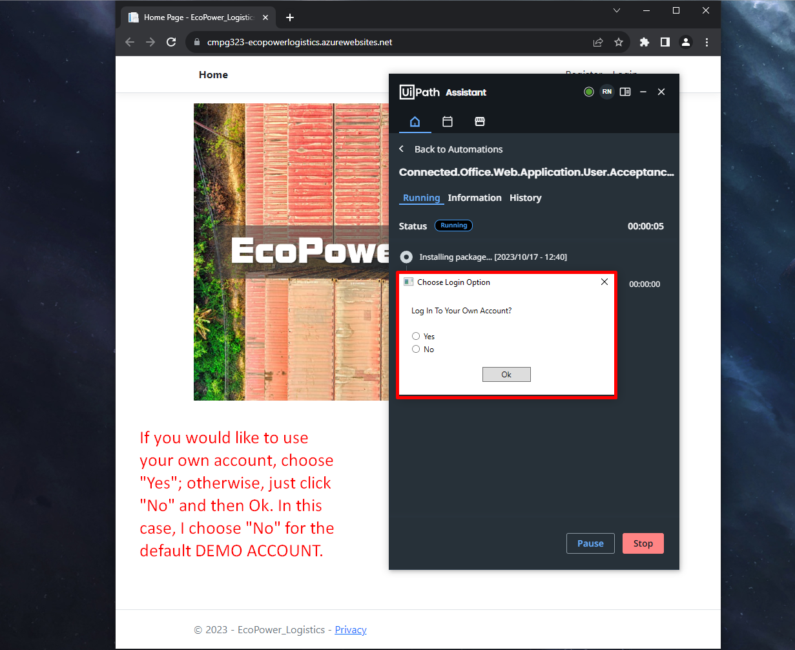

# CMPG 323 Project 4 - 33152985

## DESCRIPTION OF APPLICATION

1. The application takes an .xlsx file (Excel) and then uses the data within to populate the site.
2. When prompted to login, the user can login to the default demo account or their own custom account.
3. The program populates the data in order according to Products -> Customers -> Orders -> Order Details.
4. Once the program is finished, it will display a message saying it is finished.

## REFERENCES

## LINK FOR WEB APPLICATION

Link for Web Application: https://cmpg323-ecopowerlogistics.azurewebsites.net  

## 1st Step To Run The Application

## 2nd Step Is To Choose Login Option (Demo Account Or Custom Account)

## Program Will Start Populating The Website With Data From The Excel File

NOTE: Please put the .xlsx file in the Project Folder if not already present. The file should be: "CMPG323 EcoPower Logistics Data.xlsx"

## Program Will Edit Once All Records Are Created

## Program Finally Deletes All The Records

